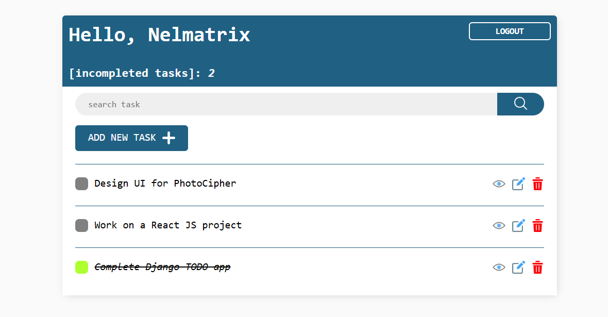
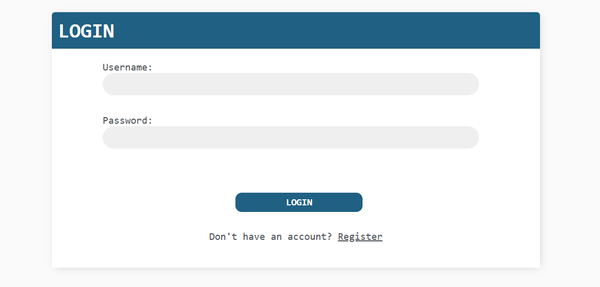
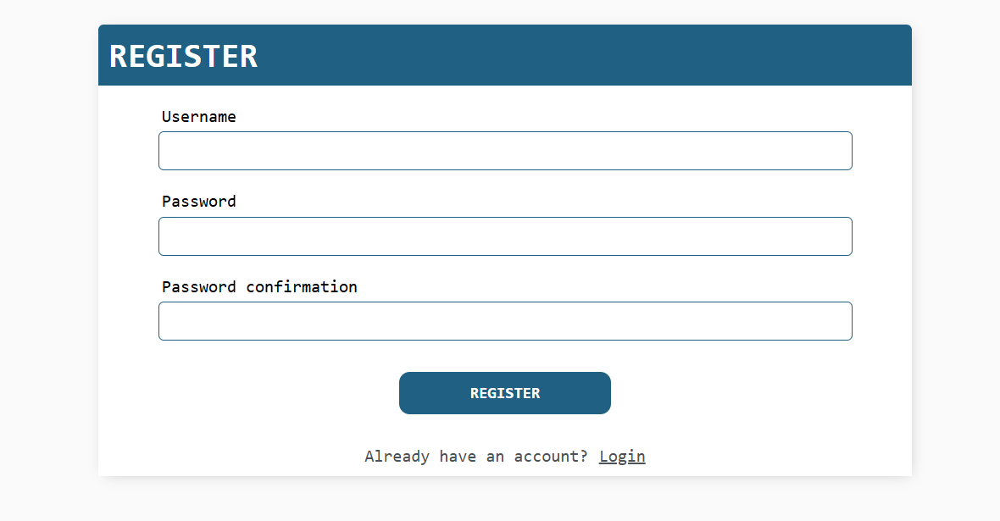
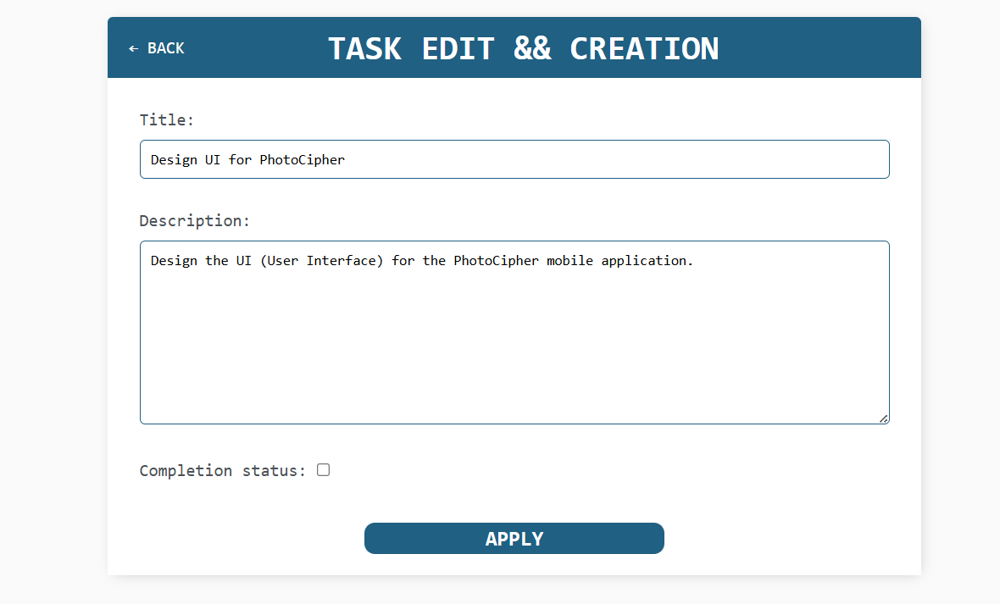
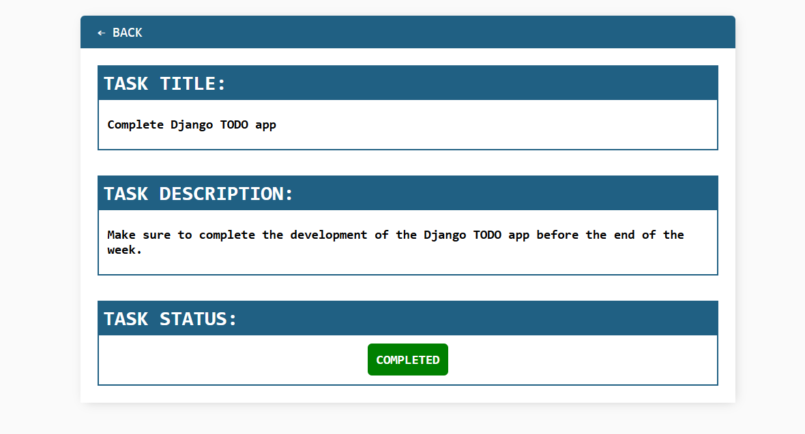
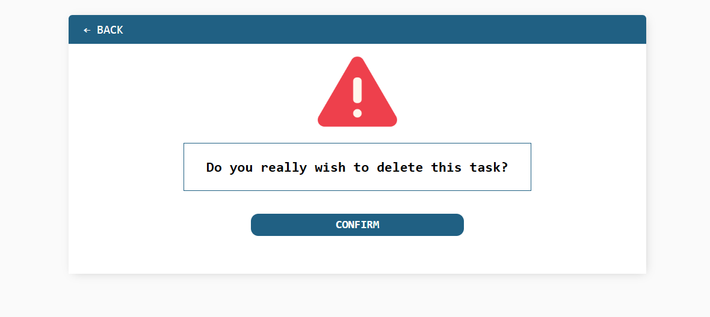

# DJANGO TODO APP

A simple todo web application, built using the Django framework. This project was built as part of my introduction to the Django framework, and my training as a fullstack developer using Python as my primary language.

---
  

  

  

  

  

  

---
MIT LICENSE  

---